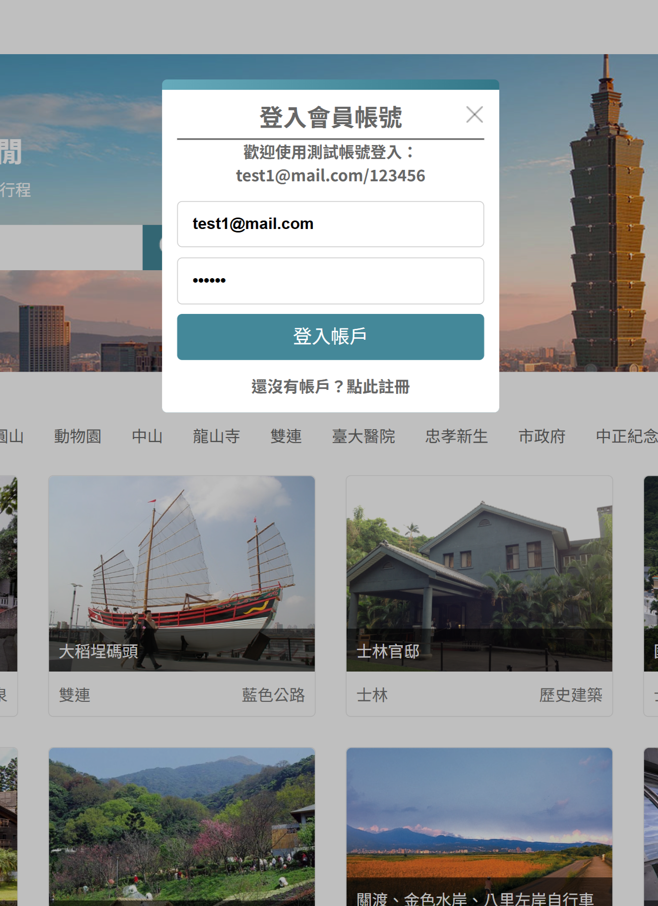
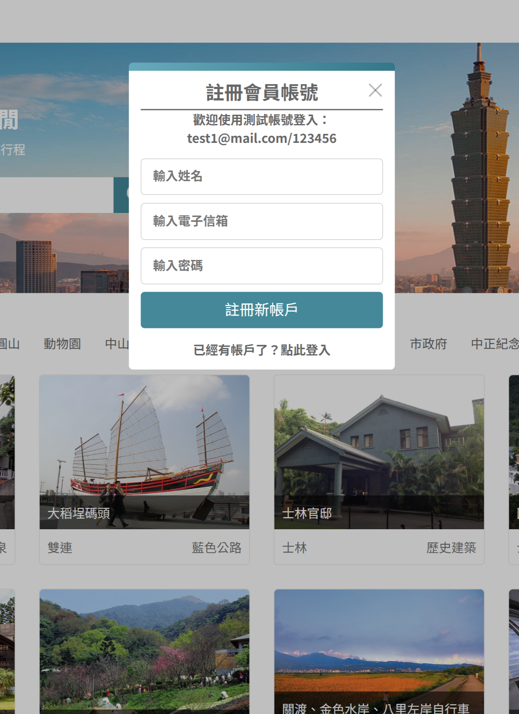
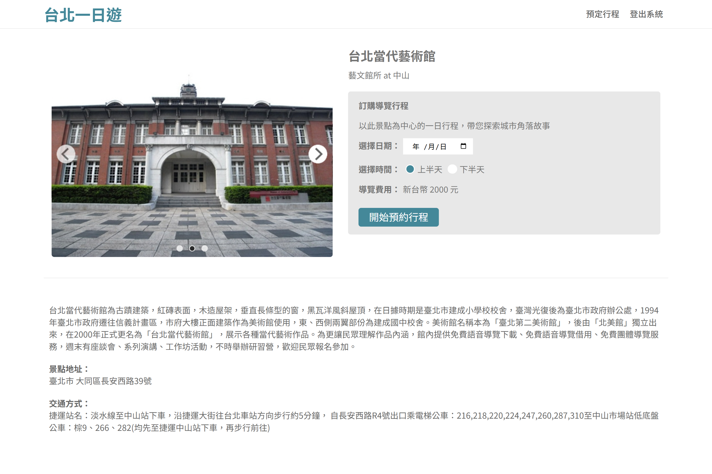
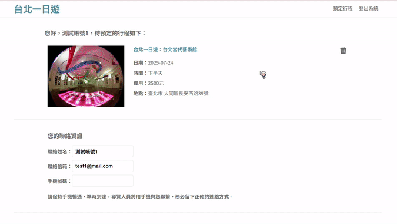
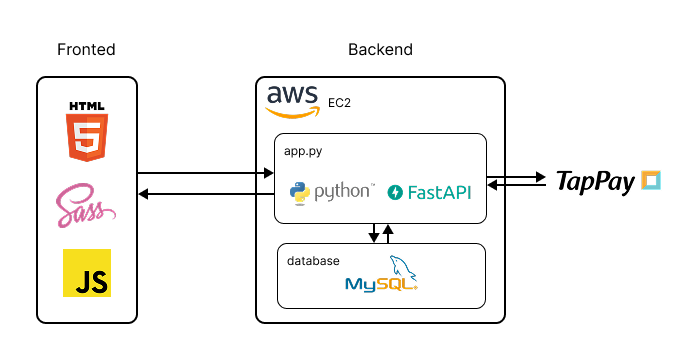
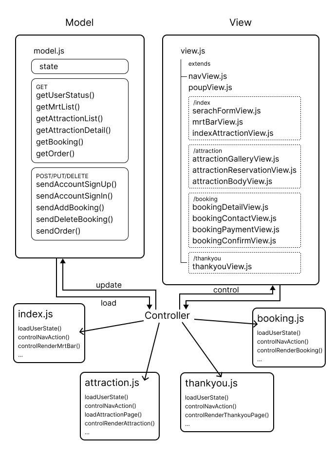

# [台北一日遊](http://57.182.192.24:8000/)

「[台北一日遊](http://57.182.192.24:8000/)」是一個包含完整消費流程的旅遊電商網站練習專案。使用者可以註冊帳號，在網站上瀏覽、預約台北觀光導覽行程，並使用信用卡付款。

- 測試帳號
  | | 帳號 | 密碼 |
  | --- | -------------- | ------ |
  | 1 | test1@mail.com | 123456 |
  | 2 | test2@mail.com | 123456 |
- 測試信用卡號
  | 卡號 | 效期 | CVV/CVC |
  | ------------------- | -------------------- |----------|
  | 4242 4242 4242 4242 | 任何比測試時間晚的年月 |123 |

# 目錄

- [主要功能展示](#主要功能展示)
- [技術堆疊](#技術堆疊)
- [技術細節](#功能及技術細節)
  - [前端 MVC 架構](#前端-mvc-架構)
- [聯絡我](#聯絡我)

# 主要功能展示

1. 登入/註冊會員

    

2. 透過關鍵字或點擊捷運站名搜尋景點

   

3. 查看景點詳細資訊並預約導覽

   

4. 使用信用卡付款，完成預約

   

# 技術堆疊

前端

- HTML
- Sass(SCSS)
- JavaScript

後端

- Python
- FastAPI

資料庫

- MySQL

部屬

- AWS EC2

第三方金流服務

- TapPay

# 技術細節

## 前端 MVC 架構

- Model: 保存狀態、負責與後端互動的函式

- View: 以 view.js 作為 parent class 來 extend 不同 UI 區塊的 child class，在 child class 中撰寫該區塊專屬的 UI 邏輯

- Controller: 從 model 中拿取資料 (以 load 為開頭的函式)、操控 view 的變化(以 control 為開頭的函式)

- 每個頁面獨立的 js 檔案: 各自從 controller 中載入需要的 controller 函式

# 聯絡我

email: [tanni6808450@gmail.com](mailto:tanni6808450@gmail.com)
